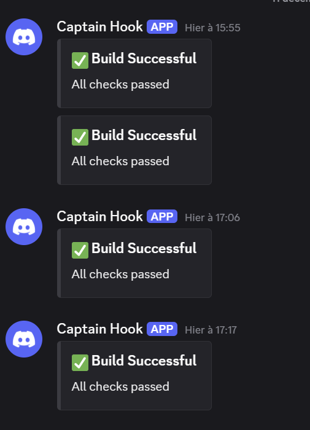

# CI/CD Rendu - Todo App

## Architecture et Choix Techniques

Ce projet est organisé en monorepo avec deux packages principaux :

- **Client** : Application React/TypeScript utilisant Vite pour le build rapide, Tailwind CSS pour le styling, et Vitest pour les tests. Interface utilisateur moderne pour gérer les todos.
- **Serveur** : API REST Express.js en TypeScript, avec Vitest pour les tests unitaires et couverture de code. Stockage des données en JSON local.

Choix techniques :
- **Vite** : Build tool rapide pour le développement frontend
- **TypeScript** : Typage statique pour une meilleure maintenabilité
- **Vitest** : Framework de test unifié pour client et serveur
- **Oxlint** : Linting rapide et moderne
- **Docker** : Conteneurisation du serveur pour le déploiement
- **Trivy** : Scan de vulnérabilités des images Docker

## Installation et Exécution Locale

### Prérequis
- Node.js 22.x
- npm

### Cloner le repo
```bash
# Installer les dépendances pour le client et le serveur
git clone https://github.com/Leo-Riche/ci-cd-rendu.git
cd ci-cd- rendu
```

### Installation
```bash
# Installer les dépendances pour le client et le serveur
cd packages/client
npm install


cd packages/server
npm install 
```

### Exécution
```bash
# Démarrer le serveur backend (port 3000)
cd packages/server
npm run dev

# Démarrer le client frontend (port 5173)
cd packages/client
npm run dev
```

### Tests
```bash
# Tests serveur avec couverture
npm run test:coverage 

# Tests client
npm run test

```

## Lien déploiement
### Backend
https://todo-api-u610.onrender.com/

### Frontend


## Pipeline CI/CD

La pipeline CI/CD est configurée dans `.github/workflows/ci.yml` et se déclenche sur :
- Pull Requests vers `main` (pour les changements dans `packages/server/`)
- Push de tags `v*.*.*` (pour les déploiements)

### Jobs de la Pipeline

1. **install** : Installation des dépendances avec cache
2. **test** : Exécution des tests serveur
3. **test-unit** : Tests unitaires avec génération de couverture
4. **coverage** : Vérification que la couverture >= 80% (PR uniquement)
5. **build** : Build du client
6. **security-scan-npm** : Audit sécurité npm
7. **docker-security-check** : Build et scan Trivy de l'image Docker
8. **notify** : Notifications Discord en cas de succès/échec

### Stratégie de Déploiement

Le déploiement n'est pas automatisé dans la pipeline actuelle.

Pour déployer :
1. Builder l'image Docker : `docker build -t todo-app:v1.0.0 ./packages/server`
2. Pousser sur un registry : `docker push your-registry/todo-app:v1.0.0`
3. Déployer l'image sur votre infrastructure

## Stratégie de Rollback

1. **Identifier la version stable** : Utiliser les tags Git et Docker pour identifier la version précédente fonctionnelle (ex: `v1.0.1`)

2. **Redeployer l'image précédente** :
   ```bash  
   docker pull your-registry/todo-app:v1.0.1
   docker tag your-registry/todo-app:v1.0.1 todo-app:latest
   docker-compose up -d 
   ```

3. **Stratégie de tagging** :
   - Tags Git : `v1.0.1`, `v1.0.2`, etc.
   - Images Docker taggées avec la même version : `todo-app:v1.0.1`
   - Permet de garder un historique des versions déployables

4. **Notifications Discord**


**Membres de l'équipe**
|NOM|Prénom|
|---|------|
|RICHE|Léo  |
|CHICHE|Raphael  |
|LORSOLD PRADON|Alyssia  |